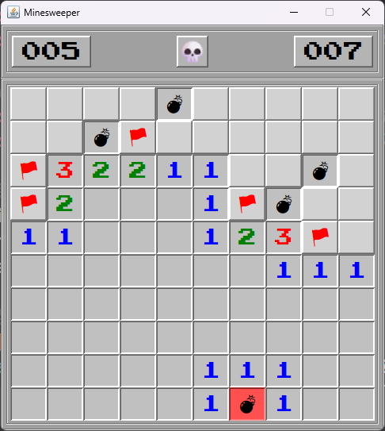

# 💣 Minesweeper

**🌐 Language / 언어 선택**
[한국어](#-한국어) | [English](#-english)

---

# 🇰🇷 한국어

Java Swing으로 구현한 클래식 지뢰찾기 게임입니다.

---

## 📸 스크린샷



---

## 🕹️ 게임 방법

- **좌클릭** — 타일 열기
- **우클릭** — 깃발 꽂기 / 해제
- **열린 숫자 칸 클릭** — 주변 깃발 수와 지뢰 수가 같으면 연쇄 열기
- **스페이스바** — 새 게임 시작

---

## ✨ 구현 기능

- 지뢰 랜덤 배치 (중복 방지)
- 인접 지뢰 수 계산 및 표시
- 0인 칸 클릭 시 연쇄 오픈 (Flood Fill)
- 우클릭 깃발 꽂기 / 남은 지뢰 수 표시
- 열린 칸 클릭 시 주변 깃발 수 기반 연쇄 열기
- 게임 오버 시 모든 지뢰 위치 공개 및 잘못된 깃발 X 표시
- 승리 조건 판정 및 자동 깃발 꽂기
- 경과 시간 타이머
- 스페이스바 새 게임 단축키
- 레트로 폰트 적용 (Press Start 2P, Noto Emoji)
- 게임 상태에 따른 버튼 이미지 변경 (기본 / 게임오버 / 승리)

---

## 🗂️ 프로젝트 구조

```
minesweeper/
├── src/
│   ├── fonts/
│   │   ├── PressStart2P-Regular.ttf
│   │   └── NotoEmoji-VariableFont_wght.ttf
│   ├── images/
│   │   ├── idle.png
│   │   ├── gameover.png
│   │   └── win.png
│   └── Minesweeper.java
├── bin/        # 컴파일 결과물 (.gitignore 처리)
└── README.md
```

---

## 🔨 빌드 및 실행

### 1단계 — Java 설치

Java 17 이상이 필요합니다.

- **Windows** — [Oracle JDK](https://www.oracle.com/java/technologies/downloads/) 또는 [Eclipse Temurin](https://adoptium.net/) 다운로드 후 설치
- **macOS** — `brew install openjdk@17`
- **Linux** — `sudo apt install openjdk-17-jdk`

설치 확인:
```bash
java -version
```

### 2단계 — 저장소 클론

```bash
git clone https://github.com/CodingKingDoyun/minesweeper.git
cd minesweeper
```

### 3단계 — 컴파일 및 실행

**Windows (cmd)**
```cmd
javac -d bin src/Minesweeper.java
xcopy src\fonts bin\fonts /E /I /Y
xcopy src\images bin\images /E /I /Y
```

**macOS / Linux / Git Bash**
```bash
javac -d bin src/Minesweeper.java
cp -r src/fonts bin/fonts
cp -r src/images bin/images
```

**공통 — 실행**
```bash
java -cp bin Minesweeper
```

---

## 🛠️ 개발 환경

- Java 17
- VS Code
- Git / GitHub

---

## 👥 기여자

| 역할 | 기여자 |
|------|--------|
| 개발 | [@CodingKingDoyun](https://github.com/CodingKingDoyun) |
| AI 어시스턴트 | [Claude](https://claude.ai) (Anthropic) |

---

## 📝 개발 노트

개발 과정에서 발생한 주요 이슈와 해결 방법은 코드 내 주석과 [Issues](https://github.com/CodingKingDoyun/minesweeper/issues)에 기록되어 있습니다.

일부 구현은 Claude (Anthropic)의 도움을 받아 작성되었습니다.

---

[맨 위로 ↑](#-minesweeper)

---
---

# 🇺🇸 English

A classic Minesweeper game implemented with Java Swing.

---

## 📸 Screenshots


---

## 🕹️ How to Play

- **Left Click** — Open a tile
- **Right Click** — Place / Remove a flag
- **Click an opened numbered tile** — Chain open if flagged neighbors match mine count
- **Spacebar** — Start a new game

---

## ✨ Features

- Random mine placement (no duplicates)
- Adjacent mine count calculation and display
- Flood fill chain open on zero tiles
- Right-click flag placement / remaining mine count display
- Chain open based on flagged neighbor count
- Game over reveals all mines and marks incorrect flags with X
- Win condition detection with auto flag placement
- Elapsed time timer
- Spacebar shortcut for new game
- Retro font applied (Press Start 2P, Noto Emoji)
- Button image changes based on game state (idle / game over / win)

---

## 🗂️ Project Structure

```
minesweeper/
├── src/
│   ├── fonts/
│   │   ├── PressStart2P-Regular.ttf
│   │   └── NotoEmoji-VariableFont_wght.ttf
│   ├── images/
│   │   ├── idle.png
│   │   ├── gameover.png
│   │   └── win.png
│   └── Minesweeper.java
├── bin/        # Compiled output (excluded via .gitignore)
└── README.md
```

---

## 🔨 Build & Run

### Step 1 — Install Java

Java 17 or higher is required.

- **Windows** — Download and install [Oracle JDK](https://www.oracle.com/java/technologies/downloads/) or [Eclipse Temurin](https://adoptium.net/)
- **macOS** — `brew install openjdk@17`
- **Linux** — `sudo apt install openjdk-17-jdk`

Verify installation:
```bash
java -version
```

### Step 2 — Clone the repository

```bash
git clone https://github.com/CodingKingDoyun/minesweeper.git
cd minesweeper
```

### Step 3 — Compile & Run

**Windows (cmd)**
```cmd
javac -d bin src/Minesweeper.java
xcopy src\fonts bin\fonts /E /I /Y
xcopy src\images bin\images /E /I /Y
```

**macOS / Linux / Git Bash**
```bash
javac -d bin src/Minesweeper.java
cp -r src/fonts bin/fonts
cp -r src/images bin/images
```

**Common — Run**
```bash
java -cp bin Minesweeper
```

---

## 🛠️ Dev Environment

- Java 17
- VS Code
- Git / GitHub

---

## 👥 Contributors

| Role | Contributor |
|------|-------------|
| Developer | [@CodingKingDoyun](https://github.com/CodingKingDoyun) |
| AI Assistant | [Claude](https://claude.ai) (Anthropic) |

---

## 📝 Dev Notes

Key issues and solutions encountered during development are documented in code comments and [Issues](https://github.com/CodingKingDoyun/minesweeper/issues).

Some implementations were assisted by Claude (Anthropic).

---

[Back to top ↑](#-minesweeper)